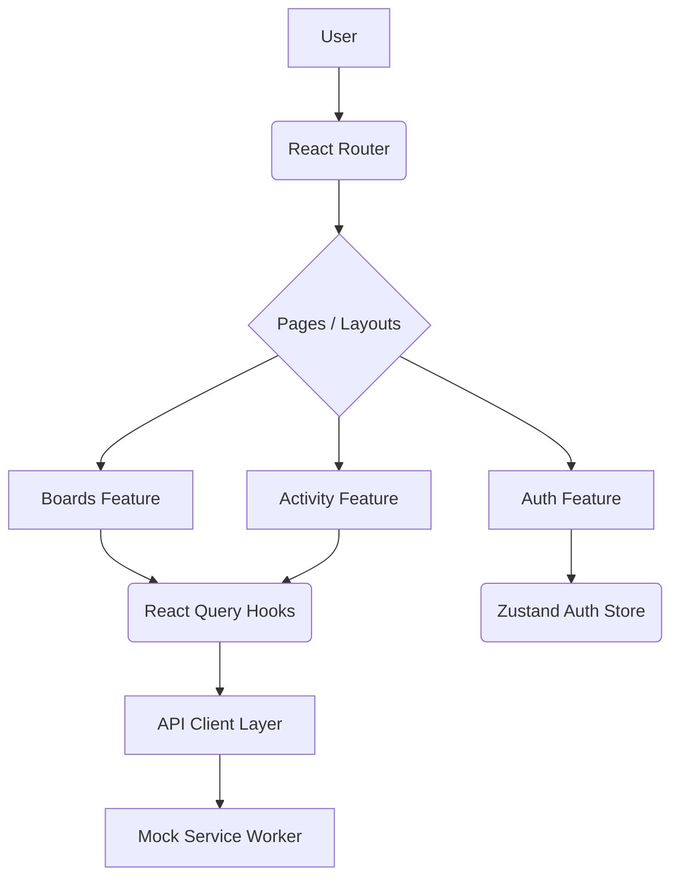

# Engineering Notes

## 1. Architecture Decisions

### Tech Stack Choices
- **React 19 & Vite**: Chosen for the latest compiler optimizations, fast development build times, and excellent TypeScript support out of the box.
- **React Router v7**: Declarative routing system that maps cleanly to our domain model (workspaces, boards, auth).
- **Tailwind CSS v4 & Shadcn UI**: Used for creating a beautiful, consistent, and fully responsive design system. Tailwind v4 offers a highly optimized, simplified config via `@theme` directives in CSS.

### Server State vs Client State Separation
- **React Query** manages all server state (e.g., boards, workspaces, tasks). This abstracts away data fetching logic, caching, background polling (for the activity feed), and provides optimistic updates seamlessly.
- **Zustand** manages global client UI state (e.g., user session, selected workspace id). Zustand was chosen because it's boilerplate-free and integrates cleanly with React without wrapping the app in context providers.

## 2. State Management Strategy
- **Zustand (`authStore`, `workspaceStore`)**: Used with the `persist` middleware to save the JWT token and the user's active workspace ID across browser sessions.
- **React Query (`useBoards`, `useTasks`)**: Centralizes the remote state logic. We use query invalidation after mutations to keep the UI perfectly synchronized with the server (MSW in this case) without manual DOM manipulation.

## 3. Data Fetching Approach
We abstracted `fetch` into an `apiClient` (`services/api/client.ts`).
- It automatically pulls the token from the Zustand persisted state and injects it into headers.
- It provides centralized error handling.
- React Query wraps this client, providing `isLoading` states for skeleton loaders and error states out of the box.

## 4. Folder Structure Explanation
A **feature-based** architecture was utilized. Instead of separating files purely by file type (grouping all hooks, all components), we group them by feature context (`auth`, `boards`, `tasks`, `workspaces`, `activity`).
This scales better because it encapsulates everything related to a domain entity in a single place. Generic UI components reside in `components/ui`.

## 5. Drag and Drop implementation
- **@dnd-kit** was chosen over alternatives like `react-beautiful-dnd` (which is deprecated) because it is accessible, lightweight, and supports multiple sortable containers natively.
- **Tradeoff**: State must be handled carefully. Optimistic UI updates happen inside `onDragOver` for immediate visual feedback, while the actual API request to persist the move triggers in `onDragEnd`.

## 6. Public Page SEO Decisions
- **`react-helmet-async`** handles injecting dynamic `<title>`, `<meta name="description">`, and OpenGraph/Twitter tags into the `<head>` of the `PublicBoardPage`. 
- Since the public board can be accessed without auth, the MSW handler returns both board meta data and all tasks in a single request for faster rendering and better crawler experience.

## 7. Scalability Considerations
- **Mock Service Worker (MSW)** enables a clean separation of frontend and backend. When the actual API is ready, MSW can simply be turned off and the `apiClient` base URL swapped.
- Zustand global stores are very small and decoupled. Adding a new theme store or preferences store won't cause unnecessary re-renders in unrelated components.

## 8. Caching & Offline Support
- **Advanced Caching**: React Query is configured with specific `staleTime` and `gcTime` limits tailored to the volatility of each entity type (e.g., tasks are volatile, workspaces are stable). This minimizes unnecessary requests.
- **Persistence**: We use `@tanstack/react-query-persist-client` with `localStorage`. This allows the application to instantly render the last known state on refresh without waiting for the network.
- **Offline Mode**: A custom `useOffline` hook detects `navigator.onLine` changes. A persistent offline banner notifies the user when they lose connection, seamlessly falling back to the persisted cache.

## 9. Mock Service Worker (MSW) Expansion
- The MSW handlers were expanded to provide complex, realistic mock data across multiple related entities (Workspaces -> Boards -> Tasks -> Activities).
- Handlers are fully typed and simulate real backend behavior, properly handling optional fields (`storyPoints`, `dueDate`, `labels`) seamlessly.

## 10. Performance & Prefetching
- **Component Memoization**: Heavy components (`ColumnComponent`, `TaskCard`) are wrapped in `React.memo` to prevent unnecessary re-renders during drag operations. Event handlers (`handleTaskClick`) are stabilized with `useCallback`.
- **Prefetching**: Data is prefetched preemptively on hover (in the Sidebar) and on Workspace Switch (dropdown) to eliminate loading spinners entirely when navigating the application.

## 11. Future Improvements
- **Undo Task Move**: Since React Query manages state, an optimistic update could save the previous state Snapshot to allow "undoing".
- **Pagination/Infinite Scroll**: The Activity Feed could implement `useInfiniteQuery` to support loading more history.
- **Dark Mode**: Add a `next-themes` provider and a toggle button to utilize the Tailwind dark class variants already defined in `index.css`.

---

### Architecture Diagram

